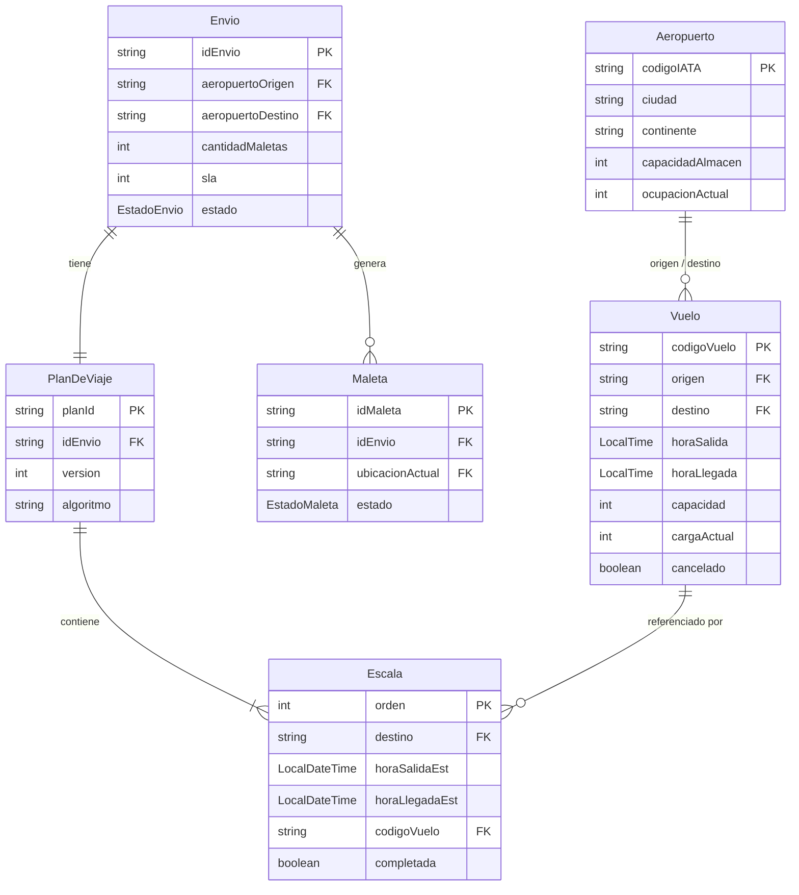
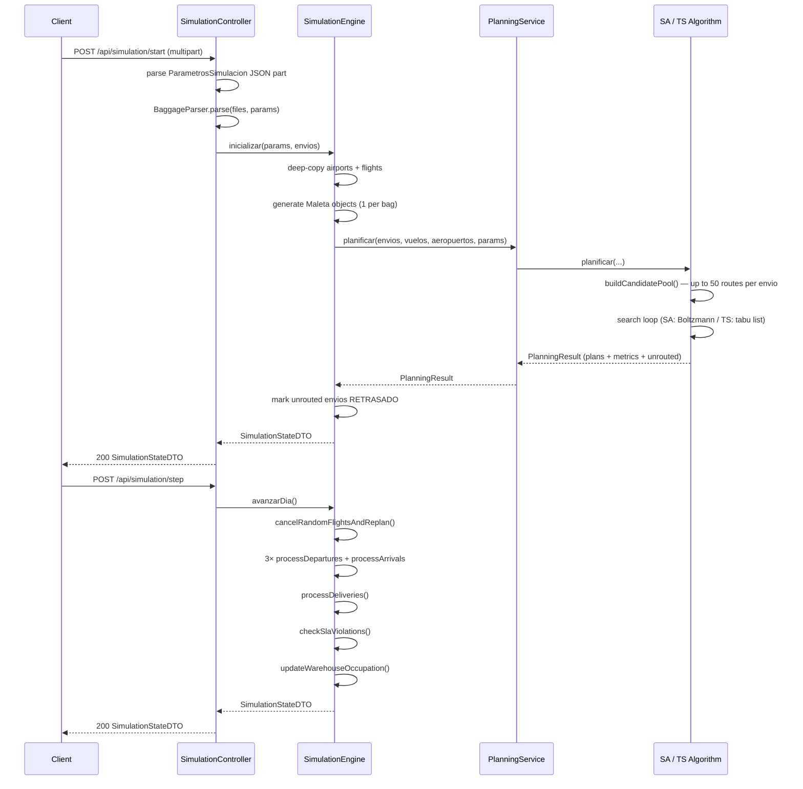
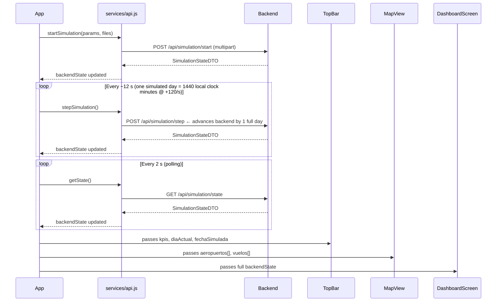

# TASF.B2B — Luggage Manager


## 🗺️ Overview

TASF.B2B is a **baggage-management operations simulation platform** for multi-airport airline cargo routing. Given a set of shipment files, it computes optimal multi-hop routes across 30 real airports on three continents using metaheuristic algorithms, then simulates day-by-day dispatch while handling random flight cancellations, dynamic replanning, and SLA tracking.

**Problem it solves:** airline operations teams need to validate routing strategies before deploying them to production. This platform lets operators load real shipment data, choose between Simulated Annealing and Tabu Search, configure SLA thresholds and warehouse capacities, and observe the full simulation on an interactive live map — all without touching a production system.

**Target users:** airline operations engineers, logistics researchers, and software teams prototyping baggage management algorithms.

---

## 🏗️ Architecture

### System Overview

```mermaid
graph TD
    subgraph Browser["Browser (React + Vite :5173)"]
        UI[App.jsx — screen router]
        MAP[MapView — Leaflet]
        SCREENS[ConfigScreen / DashboardScreen / EnviosScreen / VuelosScreen / ResultadosScreen]
        API[services/api.js]
    end

    subgraph Backend["Spring Boot (:8080)"]
        CTRL[SimulationController]
        SVC[SimulationEngine]
        PLAN[PlanningService]
        SA[SimulatedAnnealingAlgorithm]
        TS[TabuSearchAlgorithm]
        PARSE[BaggageParser / AirportParser / FlightParser]
        DATA[DataLoaderService]
        RESOURCES[aeropuertos.txt / planes_vuelo.txt]
    end

    USER[Operator] -->|uploads _envios_*.txt + params| UI
    UI --> API
    API -->|POST /api/simulation/start| CTRL
    API -->|POST /api/simulation/step| CTRL
    API -->|GET /api/simulation/state| CTRL
    CTRL --> SVC
    SVC --> PLAN
    PLAN --> SA
    PLAN --> TS
    DATA -->|@PostConstruct| RESOURCES
    DATA --> SVC
    PARSE -->|parses upload| SVC
```

### Frontend ↔ Backend Communication

The React SPA communicates exclusively through REST over HTTP. `services/api.js` targets `http://localhost:8080/api`. After starting a simulation the frontend enters a **polling loop** (`GET /state` every 2 s) and an **auto-step loop**. The auto-step works as follows: a local counter (`simClockMinutes`) increments by 120 minutes every real second (`SIM_MINUTES_PER_REAL_SECOND = 120`); once it reaches 1440 (= one full simulated day), `POST /step` is fired and the counter resets to 0. Each call to `/step` advances the backend by **exactly one day**. A simulated day therefore takes ~12 real seconds to elapse. CORS is configured on the backend to accept all `localhost:*` origins.

### Domain Entity Relationships



---

## ⚙️ Backend Flow

### Folder Structure

```
backend/src/main/java/com/tasf/backend/
├── BackendApplication.java          # Spring Boot entry point
├── algorithm/
│   ├── MetaheuristicAlgorithm.java  # Strategy interface
│   ├── RoutePlannerSupport.java     # Abstract base: candidate pool, objectives, constraints
│   ├── RouteCandidate.java          # Value object: ordered list of Leg records
│   ├── SimulatedAnnealingAlgorithm.java  # SA implementation (@Component "SIMULATED_ANNEALING")
│   └── TabuSearchAlgorithm.java     # TS implementation (@Component "TABU_SEARCH")
├── config/
│   └── CorsConfig.java              # WebMvcConfigurer: allows localhost:* on /api/**
├── controller/
│   └── SimulationController.java    # REST endpoints (mapped to /api)
├── domain/                          # Core business entities (Lombok @Data @Builder)
│   ├── Aeropuerto.java  Vuelo.java  Envio.java  Maleta.java
│   ├── PlanDeViaje.java  Escala.java  ParametrosSimulacion.java
│   ├── PlanningResult.java  MetricaAlgoritmo.java
│   ├── EstadoEnvio.java  EstadoMaleta.java  Cancelacion.java
│   └── Almacen.java  Aerolinea.java
├── dto/                             # API-facing projections (no business logic)
│   ├── SimulationStateDTO.java      # Full simulation snapshot
│   ├── AeropuertoDTO.java  VueloDTO.java  EnvioDTO.java
│   └── KpisDTO.java  ThroughputDiaDTO.java
├── parser/
│   ├── AirportParser.java           # UTF-16LE reader for aeropuertos.txt
│   ├── FlightParser.java            # UTF-8 reader for planes_vuelo.txt
│   └── BaggageParser.java          # Streaming reader for _envios_*.txt uploads
└── service/
    ├── DataLoaderService.java       # @PostConstruct static data loader
    ├── PlanningService.java         # Dispatches to SA or TS; wraps PlanningResult
    └── SimulationEngine.java        # Synchronized singleton: full simulation state machine
```

### Request Lifecycle



### API Endpoints

#### Simulation

| Method | Path | Auth | Body / Params | Response |
|--------|------|------|---------------|----------|
| `POST` | `/api/simulation/start` | — | `multipart/form-data`: `params` (JSON) + `files[]` | `SimulationStateDTO` |
| `POST` | `/api/simulation/step` | — | — | `SimulationStateDTO` |
| `GET` | `/api/simulation/state` | — | — | `SimulationStateDTO` or `204` |
| `POST` | `/api/simulation/reset` | — | — | `200 OK` |
| `POST` | `/api/simulation/cancel-flight/{codigoVuelo}` | — | path variable | `SimulationStateDTO` |
| `POST` | `/api/simulation/cancel-envio/{idEnvio}` | — | path variable | `SimulationStateDTO` |

#### Resources

| Method | Path | Auth | Response |
|--------|------|------|----------|
| `GET` | `/api/airports` | — | `List<AeropuertoDTO>` |
| `GET` | `/api/flights` | — | `List<VueloDTO>` |
| `GET` | `/api/envios` | — | `List<EnvioDTO>` (without plan detail) |
| `GET` | `/api/envios/{id}` | — | `EnvioDTO` with full `planDetalle`, or `404` |

### Design Patterns

| Pattern | Where Applied |
|---------|---------------|
| **Strategy** | `MetaheuristicAlgorithm` interface → `SimulatedAnnealingAlgorithm` / `TabuSearchAlgorithm` selected at runtime by `PlanningService` |
| **Template Method** | `RoutePlannerSupport` provides candidate pool generation, objective function, and hard-constraint checks; subclasses implement only the search loop |
| **Builder** | Lombok `@Builder` on all domain and DTO classes |
| **DTO / Domain Separation** | Internal domain objects never leave the service boundary; controllers produce DTOs |
| **Synchronized Singleton** | `SimulationEngine` is a Spring `@Service` singleton; every public method is `synchronized` for thread safety |
| **Service Layer** | `DataLoaderService` (static catalog), `PlanningService` (algorithm dispatch), `SimulationEngine` (stateful runtime) |

---

## 🖥️ Frontend Flow

### Component Tree

```
App.jsx  (global state: screen, backendState, polling intervals, theme)
├── TopBar.jsx           — KPI strip, day/time clock, 4 nav tabs, Start/Pause/Reset
│                          Tab order: OPERACIONES | ENVÍOS | DASHBOARD | RESULTADOS
├── LeftPanel.jsx        — Filter chips, warehouse threshold slider, legend
├── RightPanel.jsx       — Flight feed, operational summary
│
├── [screen === 'main']       → tab: OPERACIONES
│   └── MapView.jsx     — Leaflet map: airport circles, route polylines, airplane marker
│
├── [screen === 'envios']     → tab: ENVÍOS
│   ├── EnviosScreen.jsx   — Filterable shipments table
│   └── DrawerEnvio.jsx    — Shipment detail + escala timeline + cancel action
│
├── [screen === 'dashboard']  → tab: DASHBOARD
│   ├── DashboardScreen.jsx — KPI cards, stacked bar chart, airport occupation table
│   └── DrawerAeropuerto.jsx
│
├── [screen === 'config']     → tab: RESULTADOS (active while no simulation running)
│   └── ConfigScreen.jsx   — Simulation setup wizard
│
└── [screen === 'resultados'] → tab: RESULTADOS
    └── ResultadosScreen.jsx — Final SLA summary, airport stats, CSV export

NOTE: VuelosScreen.jsx is imported in App.jsx but is dead code —
      no tab key maps to 'vuelos' and screen is never set to that value.
```

### Data Flow



### Route / Screen Navigation

Navigation is **state-driven** — no `<Route>` declarations. `App.jsx` holds a `screen` string and conditionally renders the matching screen component. `react-router-dom` is a declared dependency but not used.

| `screen` value | Rendered Component | Tab label | Triggered by |
|----------------|--------------------|-----------|--------------|
| `'main'` | `MapView` + panels | **OPERACIONES** | Tab click |
| `'envios'` | `EnviosScreen` | **ENVÍOS** | Tab click |
| `'dashboard'` | `DashboardScreen` | **DASHBOARD** | Tab click |
| `'config'` | `ConfigScreen` | **RESULTADOS** (active) | Start button (no active sim) |
| `'resultados'` | `ResultadosScreen` | **RESULTADOS** | Auto-navigate when `finalizada === true` |

> `VuelosScreen.jsx` is imported but no tab key maps to `'vuelos'` — currently dead code.

### State Management

No Redux, Zustand, or Context API. All global state is `useState` / `useRef` in `App.jsx`:

| State variable | Type | Purpose |
|----------------|------|---------|
| `backendState` | `SimulationStateDTO \| null` | Last API snapshot |
| `screen` | `string` | Active screen |
| `useBackend` | `boolean` | API-driven vs. pure-frontend mode |
| `autoStep` | `boolean` | Enables the local clock tick (120 min/s); fires `POST /step` when clock reaches 1440 |
| `staticAirports` | `AeropuertoDTO[]` | Fetched once at startup |
| `pollingRef` | `Ref<IntervalId>` | Manages the 2 s polling interval |
| `autoStepRef` | `Ref<IntervalId>` | Manages the 1 s step interval |

---

## 🚀 Getting Started

### Prerequisites

| Tool | Minimum Version |
|------|----------------|
| Java (JDK) | 21 |
| Maven | 3.9+ (or use included `mvnw`) |
| Node.js | 18+ |
| npm | 9+ |

> **Windows users:** use `mvnw.cmd` instead of `./mvnw` in the commands below.

### Environment Variables

The backend uses `application.properties` — no `.env` file is needed. The frontend has one hardcoded configuration value:

```bash
# src/services/api.js — change if backend runs on a different host/port
BACKEND_BASE_URL=http://localhost:8080/api
```

To change the backend URL without modifying source code, update the `BASE_URL` constant in [src/services/api.js](src/services/api.js).

A minimal `.env.example` for future extraction:

```dotenv
# .env.example
VITE_API_BASE_URL=http://localhost:8080/api
```

### Installation & Running — Backend

```bash
cd backend

# Option A — Maven wrapper (no local Maven required)
./mvnw spring-boot:run

# Option B — local Maven
mvn spring-boot:run
```

The API is available at `http://localhost:8080/api` once the context loads (look for `Started BackendApplication` in the log).

### Installation & Running — Frontend

```bash
# From the project root
npm install
npm run dev
```

The UI is available at `http://localhost:5173` (Vite default — no port is configured in `vite.config.js`; if 5173 is already in use Vite auto-increments to `:5174`, `:5175`, etc.).

### Production Build

```bash
# Backend — creates a self-contained JAR
cd backend
./mvnw clean package -DskipTests
java -jar target/backend-0.0.1-SNAPSHOT.jar

# Frontend — produces optimized static files in dist/
npm run build
npm run preview   # serves the dist/ folder locally for validation
```

---

## 📡 API Reference

### `POST /api/simulation/start`

Initializes and runs the planning algorithm, returns the initial simulation state.

**Request** — `multipart/form-data`

| Part | Type | Required | Description |
|------|------|----------|-------------|
| `params` | JSON string | ✔ | `ParametrosSimulacion` object |
| `files[]` | file | ✔ | One or more `_envios_XXXX_.txt` baggage files |

**`ParametrosSimulacion` schema:**

```json
{
  "algoritmo": "SIMULATED_ANNEALING",
  "dias": 3,
  "esColapso": false,
  "capacidadAlmacen": 800,
  "capacidadVuelo": 300,
  "minutosEscalaMinima": 10,
  "minutosRecogidaDestino": 10,
  "umbralSemaforoVerde": 60,
  "umbralSemaforoAmbar": 85,
  "fechaInicio": "2026-01-02"
}
```

> **`esColapso`:** when `true`, the date filter for baggage files is left open-ended (no `dateTo`) and `diasSimulacion` is inferred from the last envio date in the data. The full collapse scenario UI/logic is not yet implemented beyond this parsing behaviour; the field is kept in the schema to avoid a breaking change when that feature is built.

**Response** — `200 SimulationStateDTO`

```json
{
  "diaActual": 1,
  "totalDias": 3,
  "fechaSimulada": "2026-01-02T00:00:00",
  "algoritmo": "SIMULATED_ANNEALING",
  "enEjecucion": true,
  "finalizada": false,
  "metrica": {
    "nombre": "SIMULATED_ANNEALING",
    "tiempoEjecucionMs": 1240,
    "rutasEvaluadas": 48320
  },
  "kpis": {
    "maletasEnTransito": 0,
    "maletasEntregadas": 0,
    "cumplimientoSLA": 0.0,
    "vuelosActivos": 142,
    "slaVencidos": 0,
    "ocupacionPromedioAlmacen": 12.4
  },
  "aeropuertos": [{ "codigoIATA": "SKBO", "nombre": "El Dorado", "..." : "..." }],
  "vuelos": [{ "codigoVuelo": "SKBO-SEQM-03:34", "origen": "SKBO", "..." : "..." }],
  "envios": [{ "idEnvio": "E001", "estado": "PLANIFICADO", "..." : "..." }],
  "throughputHistorial": [],
  "logOperaciones": ["Simulation initialized. 1200 envios planned."]
}
```

---

### `POST /api/simulation/step`

Advances the simulation by exactly one day. Handles cancellations, departures, arrivals, deliveries, and SLA checks.

**Response** — `200 SimulationStateDTO` (same schema as above, `diaActual` incremented).

When `diaActual >= totalDias`, the response has `"finalizada": true` and `throughputHistorial` is fully populated.

---

### `GET /api/simulation/state`

Returns the current state snapshot without advancing the simulation.

- **`200`** — `SimulationStateDTO`
- **`204 No Content`** — simulation not yet initialized

---

### `POST /api/simulation/reset`

Clears all simulation state. The engine returns to uninitialized status.

- **`200 OK`** — empty body

---

### `POST /api/simulation/cancel-flight/{codigoVuelo}`

Manually cancels a flight, rescues affected bags, and triggers Tabu Search replanning.

**Path variable:** `codigoVuelo` — e.g., `SKBO-SEQM-03:34`

**Response** — `200 SimulationStateDTO`

---

### `POST /api/simulation/cancel-envio/{idEnvio}`

Manually cancels a shipment and marks all its bags as `CANCELADA`.

**Path variable:** `idEnvio` — e.g., `E001`

**Response** — `200 SimulationStateDTO`

---

### `GET /api/airports`

Returns the airport catalog. If a simulation is active, occupation stats and semaphore values reflect the current simulation state.

**Response** — `200 List<AeropuertoDTO>`

```json
[
  {
    "codigoIATA": "SKBO",
    "nombre": "El Dorado International",
    "ciudad": "Bogotá",
    "continente": "AMERICAS",
    "lat": 4.7016,
    "lng": -74.1469,
    "capacidadAlmacen": 800,
    "ocupacionActual": 143,
    "semaforo": "verde",
    "maletasRecibidas": 340,
    "maletasEnviadas": 197,
    "ocupacionPromedio": 18.2,
    "ocupacionMaxima": 31.0
  }
]
```

---

### `GET /api/envios/{id}`

Returns full detail for a single shipment including all travel plan escalas.

**Response** — `200 EnvioDTO`

```json
{
  "idEnvio": "E001",
  "codigoAerolinea": "AV",
  "aeropuertoOrigen": "SKBO",
  "aeropuertoDestino": "LEMD",
  "cantidadMaletas": 5,
  "estado": "EN_TRANSITO",
  "sla": 2,
  "fechaHoraIngreso": "2026-01-02T08:30:00",
  "tiempoRestante": "1d 14h",
  "planDetalle": {
    "planId": "P-E001-v1",
    "idEnvio": "E001",
    "version": 1,
    "algoritmo": "SIMULATED_ANNEALING",
    "escalas": [
      {
        "orden": 1,
        "destino": "EGLL",
        "codigoVuelo": "SKBO-EGLL-22:15",
        "horaSalidaEst": "2026-01-02T22:15:00",
        "horaLlegadaEst": "2026-01-03T14:20:00",
        "completada": true
      },
      {
        "orden": 2,
        "destino": "LEMD",
        "codigoVuelo": "EGLL-LEMD-16:00",
        "horaSalidaEst": "2026-01-03T16:00:00",
        "horaLlegadaEst": "2026-01-03T19:30:00",
        "completada": false
      }
    ]
  }
}
```

---

## 🧪 Testing

### Running Tests

```bash
cd backend

# Run all tests
./mvnw test

# Run a specific test class
./mvnw test -Dtest=BaggageParserTest

# Run with verbose output
./mvnw test -Dsurefire.useFile=false
```

Test reports are generated in `backend/target/surefire-reports/`.

### Test Suite

| Class | Type | What it covers |
|-------|------|----------------|
| `BackendApplicationTests` | Spring context | Application context loads without errors |
| `BaggageParserTest` | Unit | Date-window filtering; closed window vs. open-ended `COLAPSO` mode |
| `PlanningServiceIntegrationTest` | `@SpringBootTest` | SA and TS both produce valid plans with metrics; `planificarConIncidencia` always uses Tabu Search |
| `SimulationScenarioTest` | `@SpringBootTest` | 3-day run completes with `finalizada=true` and 3 throughput entries; COLAPSO initialization; 5-day run verifies `[INCIDENCIA]` log entries |
| `SimulationControllerIntegrationTest` | `@SpringBootTest` + MockMvc | Full HTTP flow: `start → step → state → airports → flights → envios → envio/{id} → reset` |

### Test Data

`backend/src/test/resources/data/_envios_SKBO_.txt` — real-format baggage file for the SKBO (Bogotá) origin airport used by all integration tests.

### Coverage Notes

Integration tests cover the full happy path through the HTTP layer. Unit coverage focuses on the parser's date-filtering edge cases. The algorithm search loops are validated indirectly via `PlanningServiceIntegrationTest` by asserting that returned plans satisfy hard constraints (non-null flight codes, arrival before SLA deadline).

---

## 🚢 Deployment

### Running with Docker (manual)

```bash
# Backend
cd backend
./mvnw clean package -DskipTests
docker build -t tasf-backend .

# Frontend
npm run build
docker build -t tasf-frontend .
```

> No `Dockerfile` is included in the repository yet. The above is a reference for when one is added.

### Recommended Platforms

| Layer | Platform | Notes |
|-------|----------|-------|
| Backend | **Railway** / **Render** | Deploy the fat JAR; set `PORT` env var (Spring reads `SERVER_PORT`) |
| Frontend | **Vercel** / **Netlify** | Point build output to `dist/`; set `VITE_API_BASE_URL` to the backend URL |
| Container orchestration | **Docker Compose** | Recommended for local full-stack development once Dockerfiles are added |

### CI/CD

No CI/CD pipeline is configured yet. A recommended GitHub Actions setup:

```yaml
# .github/workflows/ci.yml (not yet present)
on: [push, pull_request]
jobs:
  backend:
    runs-on: ubuntu-latest
    steps:
      - uses: actions/checkout@v4
      - uses: actions/setup-java@v4
        with: { java-version: '21', distribution: 'temurin' }
      - run: cd backend && ./mvnw verify

  frontend:
    runs-on: ubuntu-latest
    steps:
      - uses: actions/checkout@v4
      - uses: actions/setup-node@v4
        with: { node-version: '18' }
      - run: npm ci && npm run build
```

### Environment Variables for Production

| Variable | Layer | Value |
|----------|-------|-------|
| `SERVER_PORT` | Backend (env override) | `8080` |
| `SPRING_SERVLET_MULTIPART_MAX_FILE_SIZE` | Backend | `500MB` |
| `VITE_API_BASE_URL` | Frontend build | `https://your-backend.railway.app/api` |
