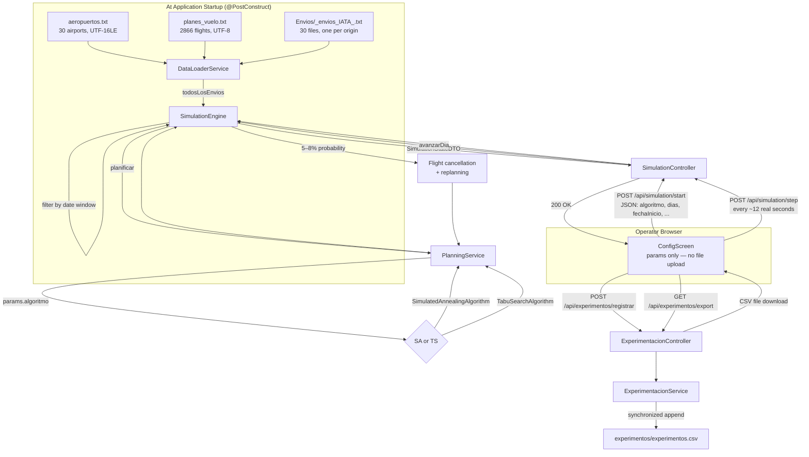
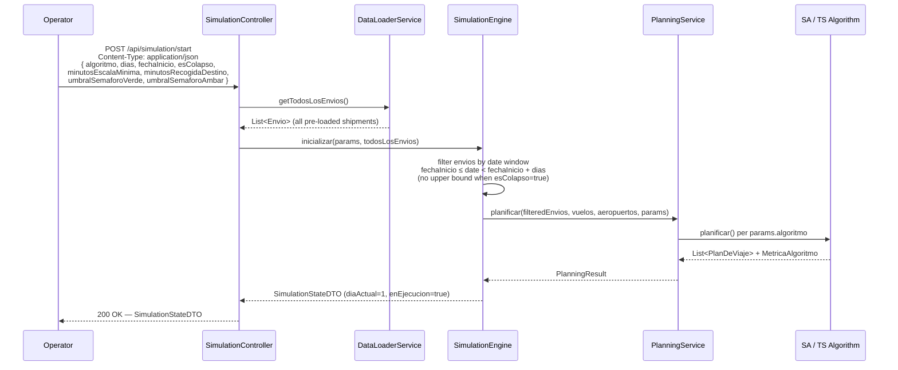
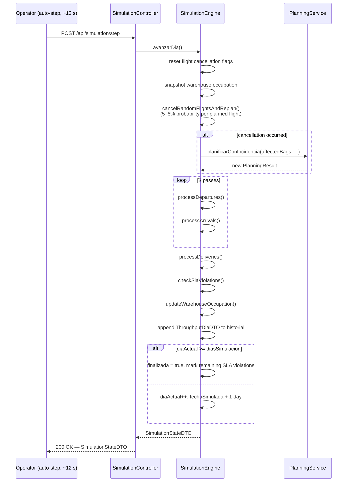

# TASF.B2B — Baggage Routing Simulation Platform


---

## 1. Overview

TASF.B2B is an interactive baggage logistics simulation platform built for airline operations research. It models the day-by-day movement of baggage shipments across a global network of 30 airports and 2,866 scheduled flights, using metaheuristic algorithms to assign the optimal route for each shipment.

**Who it is for:** operations analysts and academic researchers who need to evaluate routing strategies under realistic constraints such as SLA deadlines, warehouse capacity, and stochastic flight disruptions.

**Problem it solves:** manually assigning routes for hundreds of simultaneous shipments across continents is computationally intractable. TASF.B2B runs either Simulated Annealing (SA) or Tabu Search (TS) — selected by the operator at simulation start — to produce near-optimal routing plans within seconds, then steps through the simulation day by day while randomly injecting flight cancellations and triggering automatic replanning.

**Experimentation module:** both algorithms are available in every run. Operators can record each completed simulation as one row in a persistent CSV file, enabling side-by-side numerical comparison of SA vs TS across metrics such as SLA compliance, planning time, and average warehouse occupation.

---

## 2. Architecture — System Overview



---

## 3. Frontend ↔ Backend Communication

### Simulation lifecycle

After `POST /api/simulation/start` returns a `SimulationStateDTO`, `App.jsx` calls `startPolling()`, which fires `GET /api/simulation/state` every **2,000 ms**. If the returned state has `enEjecucion: true` or `finalizada: true` the component updates `backendState`; if `finalizada` is `true` the poll stops and the screen navigates to `resultados`.

Simultaneously, `autoStep` drives day advancement. A `setInterval` fires every **1,000 ms** and advances an internal clock by `SIM_MINUTES_PER_REAL_SECOND = 120`. When the clock reaches 1,440 (one full simulated day), `POST /api/simulation/step` is called, the clock resets to 0, and `backendState` is updated from the response. One simulated day therefore takes approximately **12 real seconds**.

### Experimentation endpoints

| Trigger | Endpoint | When |
|---|---|---|
| "Guardar experimento" button | `POST /api/experimentos/registrar` | Only callable after `finalizada: true` |
| "Descargar registro" button | `GET /api/experimentos/export` | Downloads `experimentos.csv` as a blob; 404 if no experiments exist |

Both calls are issued from `ResultadosScreen.jsx` using the named exports `registrarExperimento()` and `exportarExperimentos()` from `src/services/api.js`.

---

## 4. Backend — Folder Structure

```
backend/src/main/java/com/tasf/backend/
├── BackendApplication.java
├── algorithm/
│   ├── MetaheuristicAlgorithm.java        # interface
│   ├── RouteCandidate.java
│   ├── RoutePlannerSupport.java           # abstract base with shared helpers
│   ├── SimulatedAnnealingAlgorithm.java
│   └── TabuSearchAlgorithm.java
├── controller/
│   ├── ExperimentacionController.java     # POST /registrar, GET /export
│   └── SimulationController.java          # all /simulation/* and /airports /flights /envios
├── domain/
│   ├── Aeropuerto.java
│   ├── Aerolinea.java
│   ├── Almacen.java
│   ├── Cancelacion.java
│   ├── Envio.java
│   ├── Escala.java
│   ├── EstadoEnvio.java
│   ├── EstadoMaleta.java
│   ├── Maleta.java
│   ├── MetricaAlgoritmo.java
│   ├── ParametrosSimulacion.java
│   ├── PlanDeViaje.java
│   ├── PlanningResult.java
│   └── Vuelo.java
├── dto/
│   ├── AeropuertoDTO.java
│   ├── EnvioDTO.java
│   ├── KpisDTO.java
│   ├── SimulationStateDTO.java
│   ├── ThroughputDiaDTO.java
│   └── VueloDTO.java
├── parser/
│   ├── AirportParser.java
│   ├── BaggageParser.java
│   └── FlightParser.java
├── service/
│   ├── DataLoaderService.java             # @PostConstruct, loads all static data
│   ├── ExperimentacionService.java        # synchronized CSV writer
│   └── PlanningService.java              # algorithm selection and delegation
└── simulation/
    └── SimulationEngine.java              # stateful, @Service, all sim logic
```

---

## 5. Backend — Request Lifecycle

### a) POST /api/simulation/start



### b) POST /api/simulation/step



---

## 6. API Reference

All endpoints are under `http://localhost:8080/api`.

### Simulation

| Method | Path | Request | Response |
|---|---|---|---|
| `POST` | `/simulation/start` | JSON body: `ParametrosSimulacion` (see below) | `SimulationStateDTO` |
| `POST` | `/simulation/step` | — | `SimulationStateDTO` |
| `GET` | `/simulation/state` | — | `SimulationStateDTO` or `204 No Content` if not initialized |
| `POST` | `/simulation/reset` | — | `200 OK` |
| `POST` | `/simulation/cancel-flight/{codigoVuelo}` | Path variable | `SimulationStateDTO` |
| `POST` | `/simulation/cancel-envio/{idEnvio}` | Path variable | `SimulationStateDTO` |

**`ParametrosSimulacion` JSON fields:**

| Field | Type | Default | Description |
|---|---|---|---|
| `algoritmo` | `String` | `null` → SA | `"SIMULATED_ANNEALING"`, `"TABU_SEARCH"`, `"SA"`, or `"TS"` |
| `dias` | `Integer` | — | Number of days to simulate (required when `esColapso=false`) |
| `esColapso` | `Boolean` | `false` | When `true`, no upper date bound is applied to envio filtering |
| `fechaInicio` | `String` (ISO date) | — | Simulation start date, e.g. `"2026-01-02"` |
| `minutosEscalaMinima` | `int` | `10` | Minimum connection time in minutes |
| `minutosRecogidaDestino` | `int` | `10` | Pickup time at destination in minutes |
| `umbralSemaforoVerde` | `int` | `60` | Warehouse occupation % below which status is green |
| `umbralSemaforoAmbar` | `int` | `85` | Warehouse occupation % below which status is amber (must be > verde) |

### Static data

| Method | Path | Response |
|---|---|---|
| `GET` | `/airports` | `List<AeropuertoDTO>` |
| `GET` | `/flights` | `List<VueloDTO>` |
| `GET` | `/envios` | `List<EnvioDTO>` |
| `GET` | `/envios/{id}` | `EnvioDTO` (includes `planDetalle`) or `404` |

### Experimentation

| Method | Path | Request | Response |
|---|---|---|---|
| `POST` | `/experimentos/registrar` | — | `{ "mensaje": "Experimento registrado." }` or `400` if simulation not finished |
| `GET` | `/experimentos/export` | — | `text/csv` attachment `experimentos.csv` or `404` if no data |

---

## 7. Data Resources

```
backend/src/main/resources/data/
├── aeropuertos.txt                 # 30 airports, UTF-16LE
├── planes_vuelo.txt                # 2,866 flights, UTF-8
└── Envios/
    ├── _envios_EBCI_.txt
    ├── _envios_EDDI_.txt
    ├── _envios_EHAM_.txt
    └── ... (30 files total, one per origin IATA code)

backend/                            # created at runtime
└── experimentos/
    └── experimentos.csv            # auto-created on first POST /experimentos/registrar
```

### File details

**`aeropuertos.txt`** — Loaded by `AirportParser` at startup. Contains IATA code, name, city, country, continent, timezone offset, warehouse capacity, and WGS-84 coordinates for each of the 30 hub airports.

**`planes_vuelo.txt`** — Loaded by `FlightParser` at startup. Contains 2,866 scheduled flights. Each flight has an origin, destination, departure time, arrival time, and total capacity. Flights are daily-repeating (time only, no calendar date).

**`Envios/_envios_IATA_.txt`** — Scanned at startup by `DataLoaderService` using `PathMatchingResourcePatternResolver` with pattern `classpath:data/Envios/_envios_*.txt`. The 4-character IATA code is extracted from the filename via regex `_envios_([A-Za-z]{4})_\.txt`. Each file is parsed with `BaggageParser.parseEnvios()` using `dateFrom=LocalDate.MIN` and `dateTo=null` so all records are loaded; date-window filtering is performed later by `SimulationEngine.inicializar()`. SLA (1 day continental, 2 days intercontinental) is computed at load time from the continent map.

**`experimentos/experimentos.csv`** — Written by `ExperimentacionService`. The directory and header row are created automatically on the first call to `POST /api/experimentos/registrar`. Subsequent calls append one row; the file is never overwritten.

---

## 8. Experimentation Module

### Purpose

The experimentation module provides structured numerical output for academic comparison of Simulated Annealing and Tabu Search. Rather than relying on visual inspection of the map, researchers can run the same scenario multiple times with different algorithms and export a single CSV that captures every key metric for each run.

### How it works

1. The operator configures and runs a complete simulation (any number of days, either algorithm).
2. When the simulation finishes (`finalizada: true`), the "Experimentación numérica" section appears at the bottom of `ResultadosScreen`.
3. Clicking **"Guardar experimento"** issues `POST /api/experimentos/registrar`. The button disables immediately and turns green after a successful save, preventing duplicate rows.
4. Clicking **"Descargar registro de experimentos"** issues `GET /api/experimentos/export` and triggers a browser download of `experimentos.csv`. The file includes every run since the server started accumulating data.

### CSV columns

| Column | What it measures |
|---|---|
| `experimento_id` | UUID uniquely identifying this run |
| `fecha_hora` | UTC ISO timestamp of when the row was written |
| `algoritmo` | `SA` or `TS` |
| `dias_simulacion` | Number of simulated days |
| `tiempo_planificacion_ms` | Wall-clock time spent in the initial planning phase |
| `rutas_evaluadas` | Number of candidate routes evaluated by the algorithm |
| `fitness` | Proxy metric — same value as `rutas_evaluadas` in the current implementation |
| `envios_totales` | Total shipments loaded into the simulation |
| `envios_entregados` | Shipments with final status `ENTREGADO` |
| `envios_sla_ok` | Sum of daily `slaOk` counts from `throughputHistorial` (bag-level) |
| `pct_sla_cumplido` | SLA compliance percentage as reported by `KpisDTO.cumplimientoSLA` |
| `sla_violados` | Shipments with status `RETRASADO` at simulation end |
| `envios_no_planificados` | Shipments with status `RETRASADO` (overlaps with `sla_violados`) |
| `ocupacion_promedio_almacen` | Average warehouse occupation % across all airports (historical average) |

---

## 9. Frontend — Component Tree

```
App
├── TopBar
│   ├── day counter (diaActual / totalDias)
│   ├── simulated date display (fechaSimulada + simClockMinutes offset)
│   ├── KPI strip (maletasEnTransito, maletasEntregadas, cumplimientoSLA, ...)
│   ├── INICIAR / PAUSAR toggle
│   ├── RESET button
│   ├── theme toggle (dark / light)
│   └── nav tabs: OPERACIONES | ENVÍOS | DASHBOARD | RESULTADOS
│
├── [screen='main', configOpen=false]  — OPERACIONES view
│   ├── LeftPanel (status & route filters, SLA threshold slider)
│   ├── MapView (Leaflet, airports, animated flight arcs, envio routes)
│   │   ├── DrawerAeropuerto (slides in on airport click)
│   │   └── DrawerVuelo (slides in on flight selection)
│   └── RightPanel (active flight list, airport occupation)
│
└── [screen≠'main' or configOpen=true]  — overlay screens
    ├── ConfigScreen  [screen='config']
    │   ├── Period selector (3 days / 5 days / 7 days)
    │   ├── Algorithm selector (SA — Simulated Annealing | TS — Tabu Search)
    │   ├── Date picker (fechaInicio)
    │   ├── Escala mínima input (min=1, max=60, default=10)
    │   ├── Tiempo recogida destino input (min=1, max=60, default=10)
    │   ├── Semáforo verde threshold (< N%)
    │   ├── Semáforo ámbar threshold (< N%, must be > verde)
    │   └── Configuration summary preview
    │
    ├── EnviosScreen  [screen='envios']
    ├── DashboardScreen  [screen='dashboard']
    └── ResultadosScreen  [screen='resultados']
        ├── Simulation status banner
        ├── KPI grid (6 metrics)
        ├── Airport performance table (sorted by ocupMax)
        ├── SLA analysis bars (continental / intercontinental)
        ├── Operations log (last 100 entries)
        ├── ↓ EXPORTAR REPORTE CSV (local client-side download)
        └── Experimentación numérica section  [visible when finalizada=true]
            ├── ↑ GUARDAR EXPERIMENTO (disables after success)
            └── ↓ DESCARGAR REGISTRO DE EXPERIMENTOS
```

---

## 10. Frontend — Screen Navigation Table

| `screen` value | Rendered component | Tab label | Trigger |
|---|---|---|---|
| `'main'` | MapView + LeftPanel + RightPanel | OPERACIONES | Default on load; `onBack()` from any screen |
| `'config'` | ConfigScreen (full overlay) | *(no tab)* | First click of INICIAR when `backendState` is null |
| `'envios'` | EnviosScreen | ENVÍOS | TopBar `onNavigate('envios')` |
| `'dashboard'` | DashboardScreen | DASHBOARD | TopBar `onNavigate('dashboard')` |
| `'resultados'` | ResultadosScreen | RESULTADOS | Auto on `finalizada=true` from polling or step; TopBar `onNavigate('resultados')` |

---

## 11. Frontend — State Management Table

All state lives in `App.jsx`. There is no external state library.

| Variable | Initial value | Purpose |
|---|---|---|
| `backendState` | `null` | Last `SimulationStateDTO` received from the backend; drives all rendering |
| `autoStep` | `false` | When `true`, clock ticks every 1 s and issues `POST /step` every ~12 s |
| `simClockMinutes` | `0` | Internal clock (0–1440) that drives animation and step timing |
| `screen` | `'main'` | Which overlay is visible |
| `configOpen` | `false` | Whether ConfigScreen is shown on top of the map |
| `theme` | `'dark'` | CSS `data-theme` attribute value |
| `filters` | `{status:[…], route:[…]}` | Map filter toggles passed to LeftPanel and MapView |
| `threshold` | `80` | SLA compliance threshold for display in LeftPanel |
| `staticAirports` | `[]` | Airports fetched once at mount from `GET /airports`; used before a simulation starts |
| `selectedFlight` | `null` | IATA flight code currently selected on the map |
| `selectedRoute` | `null` | Envio ID currently selected on the map |
| `mapSelectedAirport` | `null` | Airport object passed to DrawerAeropuerto |
| `mapSelectedVuelo` | `null` | Flight object passed to DrawerVuelo |
| `leftOpen` | `true` | Left panel expanded state |
| `rightOpen` | `true` | Right panel expanded state |
| `realElapsedSeconds` | `0` | Wall-clock elapsed time displayed in TopBar |
| `running` | `false` | Local simulation clock active flag (unused after backend switch) |
| `simDay` | `1` | Local simulation day counter (unused after backend switch) |
| `simHour` | `6` | Local simulation hour (unused after backend switch) |
| `simMin` | `0` | Local simulation minute (unused after backend switch) |
| `debugOpen` | `false` | Shift+D toggles a debug overlay |

---

## 12. Getting Started

### Prerequisites

- **Java 21** (JDK)
- **Maven 3.9+**
- **Node.js 20+** and **npm**

### Installation

```bash
git clone <repo-url>
cd luggage_manager
```

> **No file upload is required.** All 30 envio files, the airport list, and the flight schedule are bundled inside the backend JAR under `src/main/resources/data/`. They are loaded automatically at startup — the operator only supplies simulation parameters in the UI.

### Run the backend

```bash
cd backend
mvn spring-boot:run -Dspring-boot.run.profiles=local
```

The server starts on `http://localhost:8080`. Startup logs will show the number of airports, flights, and total envios loaded from classpath resources, e.g.:

```
Loaded 30 airports and 2866 flights
Loaded 500 envios from _envios_SKBO_.txt (origin=SKBO)
...
Total envios loaded: 14832
```

### Run the frontend

```bash
# from the project root
npm install
npm run dev
```

The dev server starts at `http://localhost:5173` (or the next available port). Open that URL in a browser.

### Starting a simulation

1. Click **INICIAR** in the top bar.
2. In the ConfigScreen, select a period (3 / 5 / 7 days), an algorithm (SA or TS), a start date, and optionally adjust escala mínima, tiempo recogida, and semáforo thresholds.
3. Click **▶ SIMULAR**. The backend receives a JSON POST with only the parameters — no files to upload.
4. The map populates and the simulation advances one day every ~12 real seconds.
5. When complete, navigate to RESULTADOS to inspect metrics and optionally save the run to `experimentos.csv`.

---

## 13. Testing

Run all tests from the `backend/` directory:

```bash
cd backend
mvn test
```

| Test class | Type | What it covers |
|---|---|---|
| `BackendApplicationTests` | Smoke | Spring context loads without errors |
| `BaggageParserTest` | Unit | `parseEnvios()` respects a closed date window (dateFrom–dateTo) and an open-ended window (`dateTo=null`) used by collapse mode. Uses in-memory `ByteArrayInputStream` — no filesystem access. |
| `PlanningServiceIntegrationTest` | Integration | Verifies that `planificar()` and `planificarConIncidencia()` both honour `params.algoritmo`: SA runs use SA, TS runs use TS, and replanning after an incident also uses the operator-selected algorithm rather than a hardcoded fallback. Uses envios from `DataLoaderService`. |
| `SimulationScenarioTest` | Integration | Tests three full `SimulationEngine` scenarios: exact 3-day run (checks `finalizada` and `throughputHistorial.size`), collapse mode (checks `totalDias` is derived from envio span when `diasSimulacion` is preset), and a 5-day run that verifies `[INCIDENCIA]` and replanificación log entries can appear. |
| `SimulationControllerIntegrationTest` | Integration (MockMvc) | Full HTTP flow: `POST /api/simulation/start` with a JSON body (no multipart), `POST /step`, `GET /state`, `GET /airports`, `GET /flights`, `GET /envios`, `GET /envios/{id}`, `POST /reset`, `GET /state` → 204. Confirms the envio `000000001` exists with a `planDetalle` field. |
